# Relatório Integrado de Análise Exploratória de Dados (EDA)

## 1. Objetivo e Identificação do Dataset

Este relatório consolida e integra os resultados das duas análises exploratórias realizadas no projeto: a exploração textual e linguística conduzida pela equipe e a análise de integridade, contagem de tokens e segmentação experimental.

O objetivo deste levantamento é caracterizar o conjunto de dados, identificar padrões e limitações no conteúdo textual e subsidiar as decisões de pré-processamento e particionamento de texto para o fluxo de trabalho. **As análises aqui descritas têm finalidade estritamente descritiva e não rotulam nem comprovam a veracidade das notícias.**

> **Nota de reprodução:** Este documento reúne os resultados obtidos a partir dos notebooks do projeto: `tratamento_fakeNewsFinal.ipynb` e `EDA_complementar.ipynb`.

### Visão Geral do Dataset

O conjunto de dados baseia-se no arquivo `Historico_de_materias.csv` e possui as seguintes características consolidadas:

| Dimensão | Especificação / Observação |
|---|---|
| **Volume de Registros** | 10.109 notícias / matérias |
| **Campos Existentes** | `data`, `url_noticia`, `url_noticia_curto`, `titulo`, `conteudo_noticia`, `assunto` |
| **Temas Declarados** | Esportes, Economia, Política, Tecnologia, Famosos |
| **Idioma Observado** | Português |
| **Período Temporal** | 01/01/2014 a 21/04/2020 (para datas válidas) |
| **Hash SHA-256 do CSV** | `a450d9acd272d843d29af1e0b13892386a4fd68525a0d9fd48a41d359aafa24c` |
| **Domínio das URLs Principais** | 100% hospedadas sob o serviço `web.archive.org` |
| **Domínios de Origem (URL Curta)** | `globoesporte.globo.com` (4.800), `g1.globo.com` (3.538), `sportv.globo.com` (1.230), `gshow.globo.com` (540) e `redeglobo.globo.com` (1) |
| **Identificador Único Nativo** | Ausente no esquema original (utiliza-se indexador sequencial posicional de 1 a 10.109) |

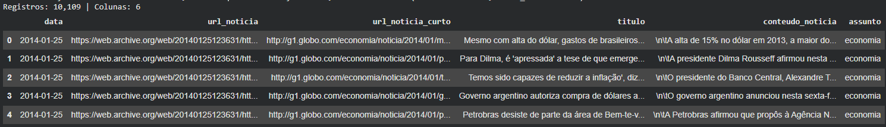

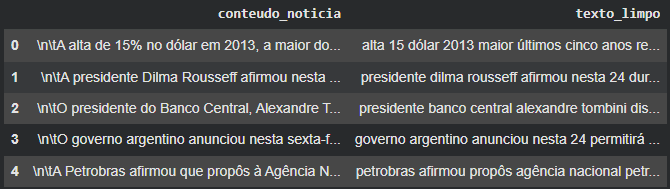

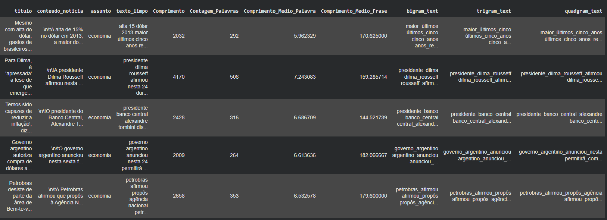

---

## 2. Qualidade e Integridade dos Dados

Para garantir rigor analítico, a análise de integridade diferenciou valores nulos no formato CSV (campos de comprimento zero) de preenchimentos aparentes contendo apenas espaços ou quebras de linha, além de inspecionar a validade sintática de datas e endereços web.

### 2.1 Preenchimento e Completude por Coluna

| Campo | Campos vazios | Apenas espaços em branco | Total não preenchido | Não preenchido (%) | Registros preenchidos | Completude (%) | Total analisado |
|---|---:|---:|---:|---:|---:|---:|---:|
| `data` | 0 | 0 | 0 | 0,00% | 10.109 | 100,00% | 10.109 |
| `url_noticia` | 0 | 0 | 0 | 0,00% | 10.109 | 100,00% | 10.109 |
| `url_noticia_curto` | 0 | 0 | 0 | 0,00% | 10.109 | 100,00% | 10.109 |
| `titulo` | 0 | 0 | 0 | 0,00% | 10.109 | 100,00% | 10.109 |
| `conteudo_noticia` | 6 | 3 | 9 | 0,09% | 10.100 | 99,91% | 10.109 |
| `assunto` | 0 | 0 | 0 | 0,00% | 10.109 | 100,00% | 10.109 |

* **Marcadores textuais de ausência:** Foram detectados 4 registros cujo valor no campo `data` consta como a string literal `"NA"` (posições 2.449 a 2.452). Se tratados formalmente como nulos, a completude real de datas passa a 99,96% (10.105 registros válidos).
* O campo `conteudo_noticia` apresenta 9 registros sem texto útil (6 vazios de fato e 3 com apenas espaços), resultando em 10.100 documentos válidos para análises de conteúdo e segmentação.

### 2.2 Conformidade de Datas, URLs e Extensão Mínima

| Critério de Validação | Quantidade | Registros considerados | Ocorrência (%) |
|---|---:|---:|---:|
| Datas com formato inválido ou inexistente | 4 | 10.109 | 0,04% |
| URLs principais com formatação incorreta | 3 | 10.109 | 0,03% |
| URLs curtas com formatação incorreta | 3 | 10.109 | 0,03% |
| Conteúdos com texto inferior a 100 caracteres | 5 | 10.100 | 0,05% |
| Conteúdos abaixo de 100 caracteres (incluindo nulos) | 14 | 10.109 | 0,14% |

As anomalias de URL concentram-se pontualmente em 3 registros (linhas 3.829, 3.833 e 8.029). Os textos com menos de 100 caracteres correspondem a notas telegráficas, charges e chamadas de galerias de imagem.

### 2.3 Diagnóstico de Duplicatas

| Critério de Unicidade | Grupos com repetição | Registros excedentes | Total de linhas envolvidas | Total considerado | Excedente (%) |
|---|---:|---:|---:|---:|---:|
| Linhas inteiras idênticas (6 colunas) | 0 | 0 | 0 | 10.109 | 0,00% |
| URL principal idêntica | 3 | 3 | 6 | 10.109 | 0,03% |
| URL curta idêntica | 19 | 20 | 39 | 10.109 | 0,20% |
| Conteúdo textual idêntico (exato) | 21 | 22 | 43 | 10.100 | 0,22% |

Não há duplicação integral de linhas. Contudo, há 21 grupos com matérias de conteúdo textual exatamente igual (totalizando 22 duplicatas a serem tratadas para evitar vazamento entre partições de treino, validação e teste). A normalização de espaçamento preserva esse mesmo quantitativo.

### 2.4 Avaliação de Indicadores de Governança e Metas de Qualidade

| Indicador Avaliado | Registros conformes | Proporção (%) | Atinge 98% neste indicador? |
|---|---:|---:|:---:|
| Presença de dados em todos os campos | 10.100 | 99,91% | **Sim** |
| Critérios locais combinados (sem vazios, datas e URLs válidas, tamanho adequado) | 10.088 | 99,79% | **Sim** |
| Critérios locais combinados com unicidade estrita | 10.067 | 99,58% | **Sim** |
| Identificador de origem documentado no esquema | 0 | 0,00% | **Não** |
| Emissor institucional certificado no esquema | 0 | 0,00% | **Não** |

**Conclusão sobre qualidade:** Os dados locais apresentam índice de completude e consistência sintática excelente (superior a 99,5%). Contudo, do ponto de vista de rastreabilidade de dados (auditoria de proveniência e emissor formal), o dataset depende das referências de URL e de identificadores criados no pipeline.

---

## 3. Distribuição Temática e Dimensões Textuais

### 3.1 Composição por Assunto

| Assunto | Registros | Proporção (%) |
|---|---:|---:|
| Esportes | 6.035 | 59,70% |
| Economia | 1.558 | 15,41% |
| Política | 1.363 | 13,48% |
| Tecnologia | 613 | 6,06% |
| Famosos | 540 | 5,34% |

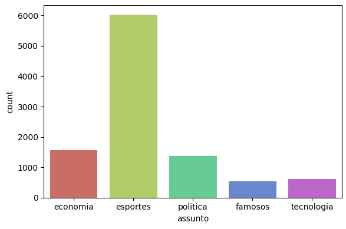

Há uma predominância expressiva do tema **Esportes** (~60% do total). Qualquer análise vocabular global refletirá esse desbalanceamento, recomendando-se estratificação por tema nas etapas de avaliação e inferência.

### 3.2 Vocabulário Tratado e Características Estatísticas

A análise do Giu avaliou o texto limpo (conversão para minúsculas, remoção de pontuação e eliminação de *stopwords* ampliada com dias da semana):

* **Assimetria (*skewness*):** 3,59, indicando uma distribuição de comprimento com cauda longa à direita (matérias muito extensas).
* **Curtose:** 24,46, confirmando presença expressiva de valores extremos.
* **Valores atípicos (*outliers*):** 178 matérias (1,76% do dataset) situam-se acima de 3 desvios padrão da média de caracteres tratados. Como decorrem de coberturas jornalísticas extensas legítimas, não devem ser eliminadas arbitrariamente.

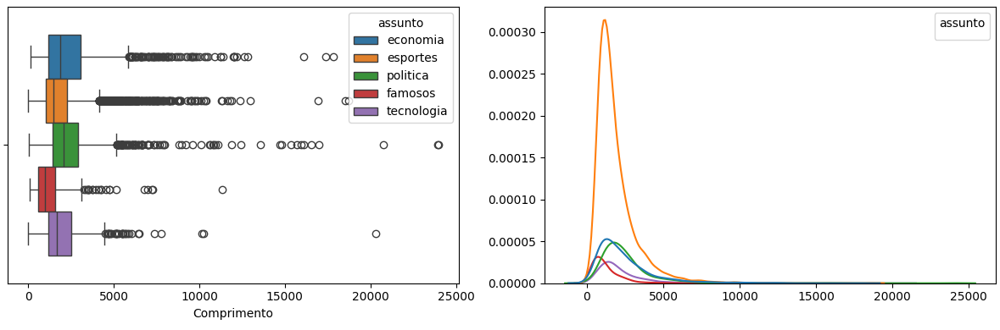

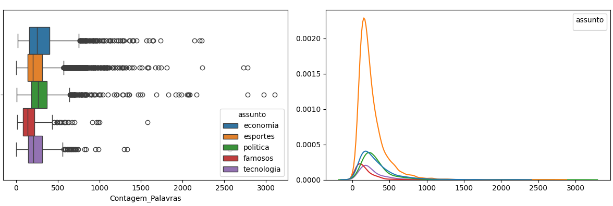

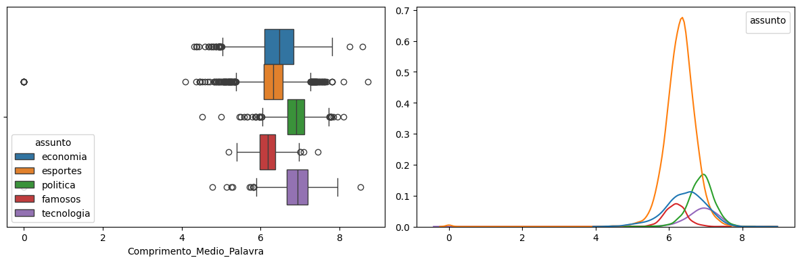

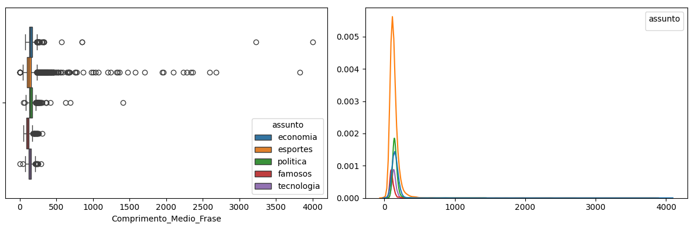

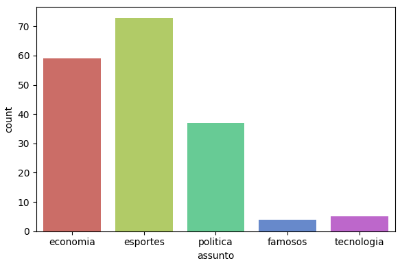

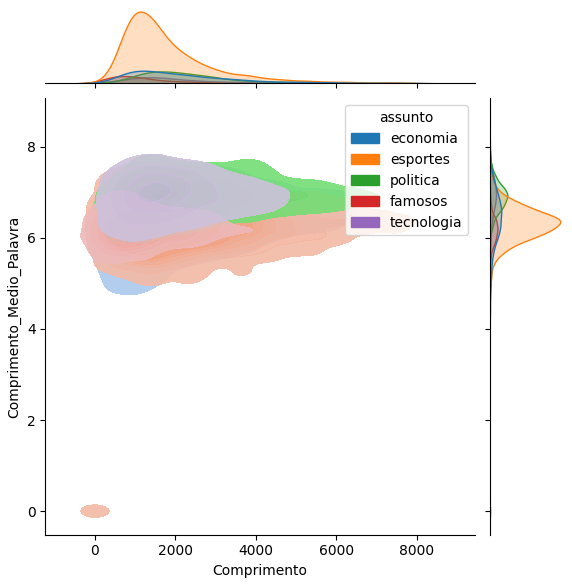

### 3.3 Análise em Tokens (Texto Original)

> **O que são Tokens?**  
> São as unidades atômicas (palavras ou pedaços de palavras / subpalavras) em que os modelos de linguagem e tokenizadores particionam o texto bruto. Uma palavra pode ser formada por um ou múltiplos tokens.

Nesta etapa, mediu-se o conteúdo original de forma íntegra via codificação BPE (`cl100k_base` do `tiktoken`, compatível com a família GPT-4/GPT-3.5), preservando pontuações, negações e maiúsculas.

#### Estatísticas Descritivas de Tokens por Assunto

| Grupo / Assunto | Registros | Mín. | 1º Quartil (Q1) | Mediana | 3º Quartil (Q3) | Percentil 95 (P95) | Máx. | Média |
|---|---:|---:|---:|---:|---:|---:|---:|---:|
| **Geral (base completa)** | 10.109 | 0 | 428 | 637,0 | 993 | 1.952,6 | 9.354 | 814,6 |
| **Geral (apenas não vazios)** | 10.100 | 1 | 428 | 637,5 | 993 | 1.953,1 | 9.354 | 815,3 |
| Economia | 1.558 | 71 | 462 | 737,0 | 1.188 | 2.389,8 | 8.053 | 957,3 |
| Esportes | 6.035 | 0 | 417 | 606,0 | 931 | 1.821,0 | 8.811 | 770,6 |
| Famosos | 540 | 44 | 246 | 423,5 | 680 | 1.260,8 | 4.909 | 534,5 |
| Política | 1.363 | 20 | 559 | 805,0 | 1.124 | 2.156,7 | 9.354 | 987,8 |
| Tecnologia | 613 | 0 | 417 | 598,0 | 910 | 1.674,2 | 7.705 | 746,5 |

#### Distribuição Proporcional por Faixas de Tamanho (% no Tema)

| Assunto | 0 a 150 | 151 a 200 | 201 a 250 | 251 a 500 | 501 a 1000 | 1001 a 2000 | 2001 a 5000 | > 5000 |
|---|---:|---:|---:|---:|---:|---:|---:|---:|
| Economia | 0,3% | 1,4% | 2,7% | 24,3% | 37,8% | 25,5% | 7,8% | 0,3% |
| Esportes | 1,1% | 1,3% | 2,8% | 31,3% | 41,9% | 18,1% | 3,5% | 0,1% |
| Famosos | 9,1% | 8,1% | 8,7% | 35,0% | 27,8% | 10,0% | 1,3% | 0,0% |
| Política | 0,7% | 0,8% | 0,6% | 16,0% | 48,5% | 26,7% | 5,8% | 1,0% |
| Tecnologia | 1,3% | 1,8% | 3,6% | 29,4% | 42,1% | 19,6% | 2,1% | 0,2% |
| **Geral** | **1,4%** | **1,6%** | **2,9%** | **28,2%** | **41,4%** | **20,0%** | **4,3%** | **0,3%** |

O dataset reúne um volume total de **8.234.880 tokens**. Cerca de **94,1% das matérias possuem mais de 250 tokens**, comprovando a necessidade técnica de quebrar textos em blocos (segmentação) para tarefas de busca e embeddings sem truncamento.


---

## 4. Análises Linguísticas: Vocabulário, Entidades e Tópicos

O notebook desenvolvido pelo colega Giu estrutura uma esteira completa de exploração linguística. O procedimento computacional está plenamente implementado no código; a consolidação definitiva de seus números e saídas gráficas em disco requer execução sequencial no ambiente do grupo.

### 4.1 Frequências Lexicais e N-gramas

O pipeline extrai unigramas, bigramas, trigramas e quadrigramas sobre o texto limpo, gerando nuvens e gráficos de frequência para inspeção de termos recorrentes:

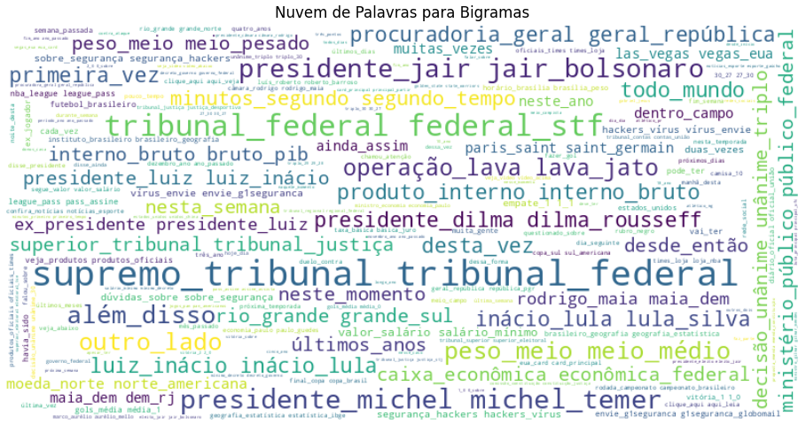

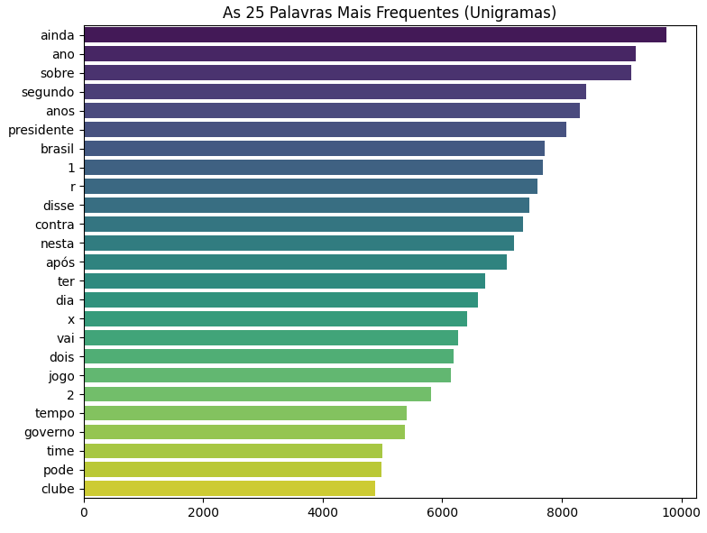

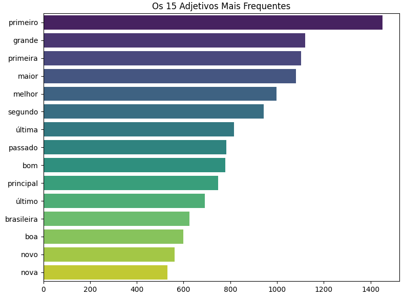

### 4.2 Reconhecimento de Entidades Nomeadas (NER) e Classes Gramaticais (POS)

> **O que é NER?**  
> *Named Entity Recognition*: processo de detecção e classificação automática de nomes próprios, organizações, locais e datas citados no texto.

O pipeline utiliza o modelo `pt_core_news_sm` do spaCy para mapear sintaxe e entidades em documentos selecionados:

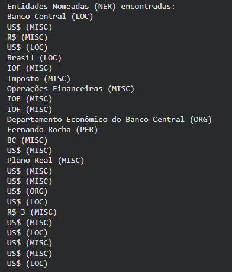

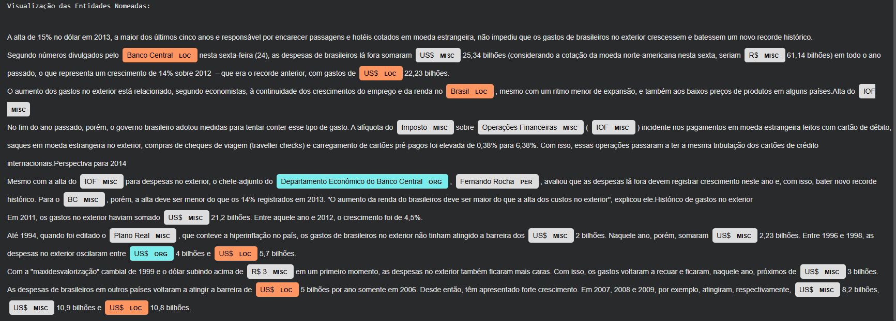

### 4.3 Representações Vetoriais (*Embeddings*) e Modelagem de Tópicos

> **O que são *Embeddings*?**  
> Vetores numéricos contínuos que representam o significado semântico do texto, permitindo comparar similaridade temática por cálculo de distância.

* **Embeddings:** Geração experimental via `sentence-transformers/all-MiniLM-L6-v2`. Recomenda-se avaliar modelos ajustados ao português em etapas futuras.
* **Projeção com t-SNE:** Redução para 2D e 3D para visualização dos agrupamentos semânticos no espaço latente.
* **BERTopic:** Modelagem de tópicos combinando embeddings, redução UMAP e agrupamento com orientação temática.

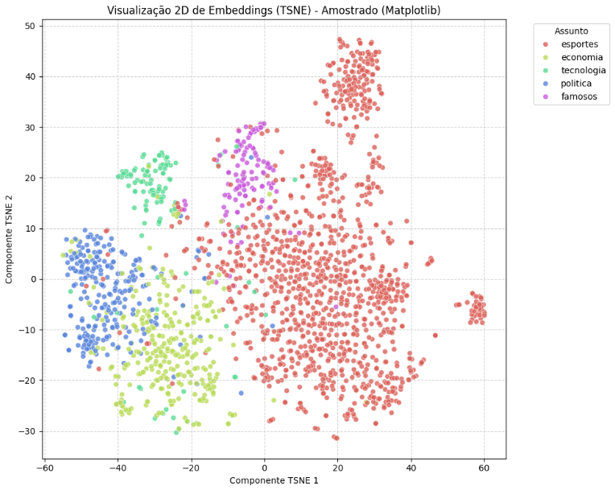

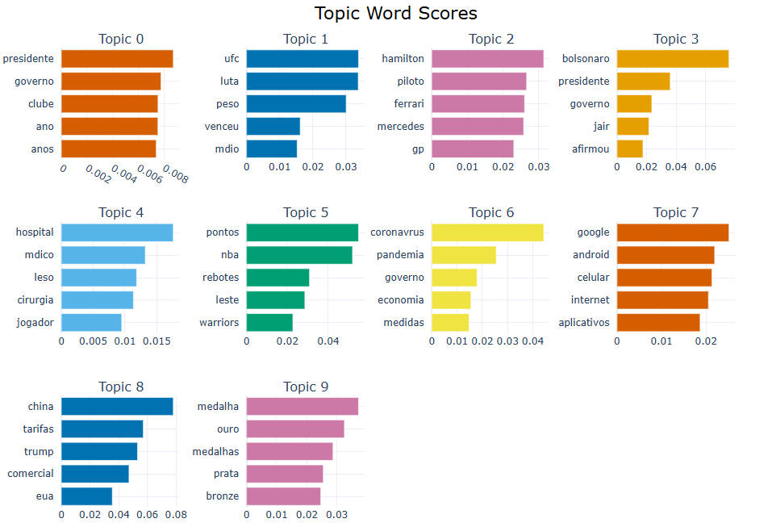

*O procedimento está totalmente estruturado no código; a tabela analítica com o ranking final dos tópicos, pesos de coerência e distribuição de entidades será exportada após a rodada completa no ambiente final.*

---

## 5. Segmentação Experimental de Texto (*Chunking*)

> **Conceitos importantes de segmentação:**  
> * **Bloco (*chunk*):** Janela delimitada de texto para alimentação de modelos de linguagem e recuperação vetorial.
> * **Sobreposição (*overlap*):** Repetição deliberada de um número fixo de tokens (aqui fixada em 30 tokens) entre o final de um bloco e o início do seguinte, evitando que orações essenciais fiquem truncadas.
> * **Posições de corte (*offsets*):** Índices numéricos exatos de início e fim no fluxo de bytes/tokens que garantem a **preservação integral de texto**, sem perda ou alteração de caracteres originais.

O experimento processou as **10.100 matérias válidas**, comparando três limites máximos de janela (**150, 200 e 250 tokens**) com **sobreposição exata de 30 tokens**, priorizando sempre fronteiras de frase (`.!?`) e de palavras:

### 5.1 Comparativo das Três Configurações

| Limite Máximo | Total de Blocos Gerados | Blocos por Documento (Média) | Mediana de Tokens | Tokens com Repetição | Fator de Expansão Global |
|:---:|---:|---:|---:|---:|:---:|
| **150 tokens** | 76.897 | 7,61 | 141 | 10.238.783 | 1,24x |
| **200 tokens** | 54.303 | 5,38 | 189 | 9.560.963 | 1,16x |
| **250 tokens** | 42.519 | 4,21 | 237 | 9.207.443 | 1,12x |


### 5.2 Conclusões Práticas do Experimento

1. **Volume versus Granularidade:** Janelas de 150 tokens aumentam significativamente a quantidade de blocos (+80% em relação a 250 tokens) e geram 24% de redundância por sobreposição. Janelas de 250 tokens produzem menos fragmentação (4,2 blocos/notícia) com expansão moderada (12%).
2. **Preservação de Contexto e Negação:** A sobreposição mitiga quebras abruptas, mas não impede que blocos isolados percam qualificadores. No documento de teste `8801`, a alegação sobre um perfil falso fica no primeiro bloco, mas o esclarecimento de que o autor *"nunca existiu"* aparece somente no bloco seguinte. 
3. **Recomendação:** A tabela completa com os milhares de cortes gerados foi preservada no artefato `tabelas/blocos_offsets.csv`. Para o pipeline de busca, nenhuma configuração mostrou-se intrinsecamente superior em recuperação antes de testes empíricos com o modelo de embeddings do projeto.

---

## 6. Síntese dos Resultados e Próximos Passos

| Achado Principal | Evidência Analítica | Ação no Projeto |
|---|---|---|
| **Predomínio de Esportes** | ~60% das matérias da base | Conduzir avaliações balanceadas por tema |
| **Alta completude dos campos** | > 99,9% de presença física de dados | Manter regras de validação sem descarte massivo |
| **Existência de matérias duplicadas** | 22 notícias idênticas excedentes | Aplicar deduplicação antes de particionar os dados |
| **Cauda longa de extensão** | Textos de até 9.354 tokens | Adotar segmentação com sobreposição (*sliding window*) |
| **Papéis distintos de representação** | Texto limpo (léxico) vs. original (semântica) | Manter o texto original íntegro para modelos neurais |

---

## 7. Roteiro Prático de Execução

Para reproduzir os resultados e gerar todas as tabelas e gráficos atualizados no repositório:

1. **Preparação dos Arquivos:**
   * Certifique-se de que o arquivo de dados `Historico_de_materias.csv` esteja presente na raiz ou dentro da pasta `originais/`.
   * Mantenha os notebooks na raiz: `tratamento_fakeNewsFinal.ipynb` e `EDA_complementar.ipynb`.

2. **Instalação das Dependências:**
   ```bash
   pip install pandas numpy matplotlib seaborn nltk spacy sentence-transformers bertopic umap-learn tiktoken
   python -m spacy download pt_core_news_sm