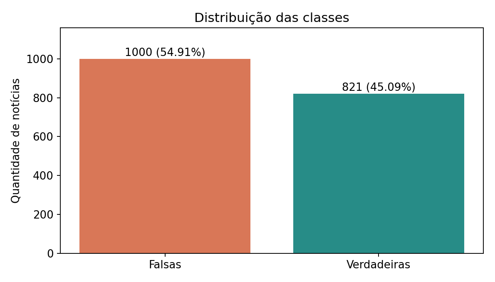
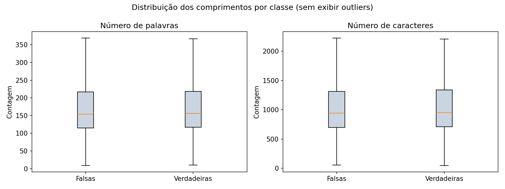
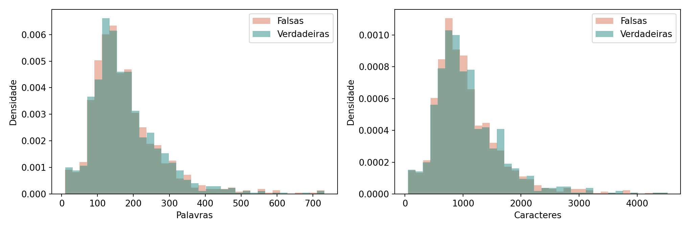
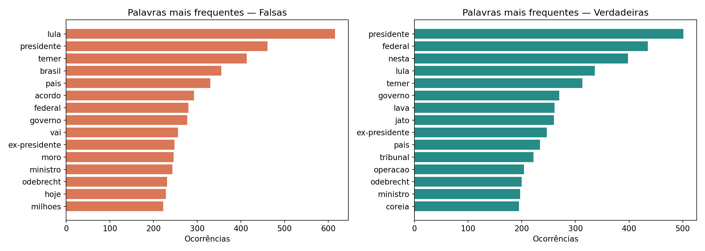
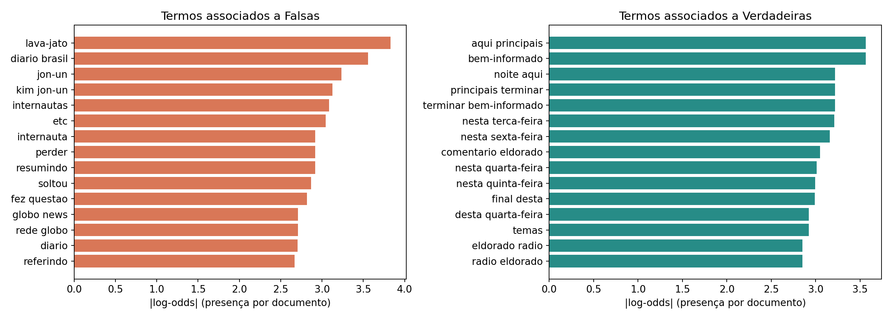
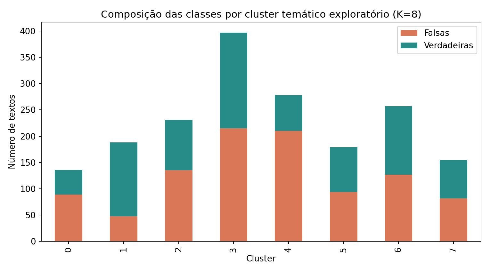
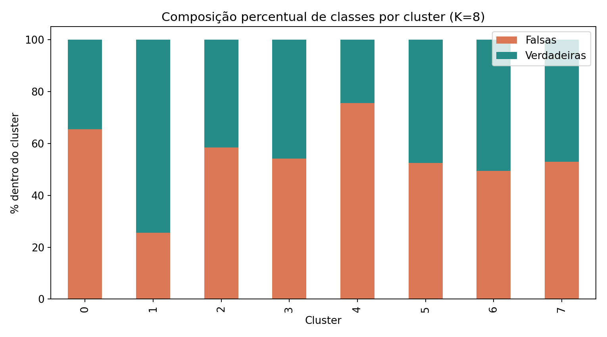
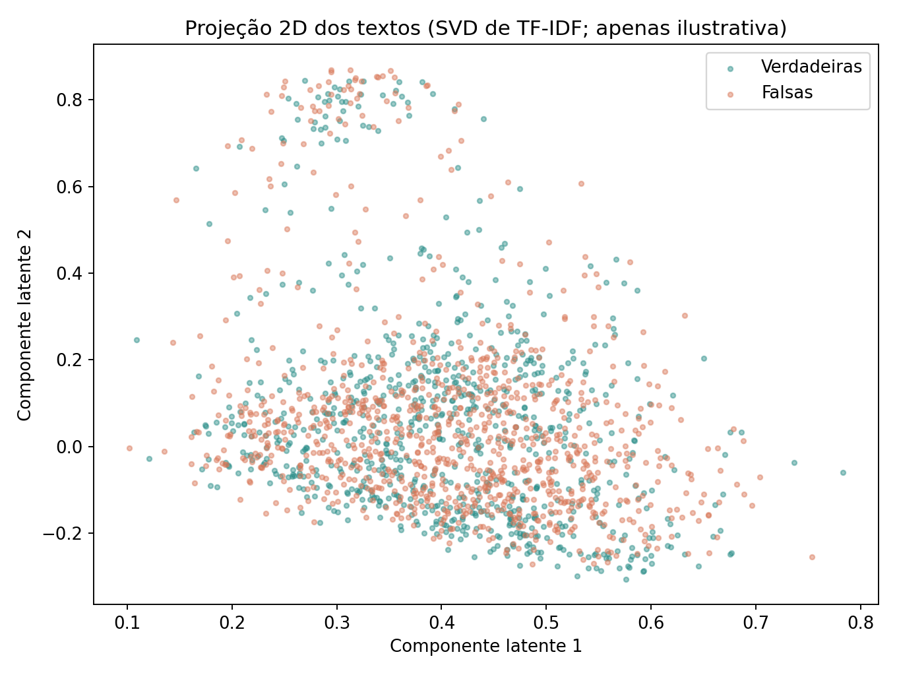

# EDA — Fake.br Corpus (size_normalized_texts)

## Fonte e escopo
Fonte: arquivo `size_normalized_texts.zip` fornecido pelo usuário, com textos das pastas `fake` e `true`. Unidade de análise: um arquivo `.txt` por notícia. A amostra presente no ZIP não deve ser confundida com a totalidade do repositório Fake.br.

## Classes e qualidade
- **Total:** 1821 textos; **falsas:** 1000 (54.9149%); **verdadeiras:** 821 (45.0851%).
- Textos vazios: 0; duplicatas exatas de conteúdo: 0.

## Comprimento dos textos
| Métrica | Falsas | Verdadeiras |
|---|---:|---:|
| Média de palavras | 177.49 | 178.13 |
| Mediana de palavras | 154 | 156 |
| Média de caracteres | 1072.64 | 1078.63 |
| Mediana de caracteres | 942.5 | 952.0 |

A proximidade das médias é compatível com a normalização de tamanho. A EDA não demonstra, isoladamente, equivalência estatística nem ausência de vieses de estilo.

## Vocabulário e n-gramas
Foram extraídos unigramas e bigramas com remoção básica de stopwords em português, normalização de acentos e corte de frequência mínima. O ranking de termos discriminantes usa a diferença de log-odds da **presença do termo por documento**, com suavização aditiva. Trata-se de associação descritiva, não de inferência causal nem de avaliação de capacidade preditiva em dados não vistos.

Consulte `vocabulario_frequente.csv` e `termos_discriminantes.csv` para os rankings completos.

## Exploração de viés temático com clustering
Procedimento independente e exploratório: TF-IDF de unigramas e bigramas, TruncatedSVD com 40 componentes, normalização L2 e MiniBatchKMeans com **K=8** e semente 42. K foi escolhido apenas como exemplo para visualização; não é uma estimativa validada do número de temas nem reproduz necessariamente o pipeline de treinamento. A projeção 2D captura apenas uma parte da estrutura do corpus.

A associação entre clusters exploratórios e rótulos apresenta qui-quadrado = **124.47**, p = **8.97e-24** e V de Cramér = **0.261**. Como os clusters são aproximações não supervisionadas dos temas, o resultado **sugere** heterogeneidade de composição por agrupamento, mas não prova que o balanceamento temático melhora generalização ou era estritamente necessário.

Para justificar o balanceamento do **script real**, recomenda-se (i) executar a mesma vetorização e o mesmo K do treino, (ii) visualizar os clusters antes e depois do balanceamento, (iii) comparar divergências entre classes por cluster e (iv) medir desempenho em conjunto de teste intocado, sem vazamento entre treino e teste.

## Limitações
- Este ZIP contém 1.821 textos e pode ser um subconjunto do corpus integral.
- A contagem de palavras usa sequências Unicode de caracteres alfanuméricos, não um tokenizador linguístico especializado.
- Stopwords simples podem deixar palavras funcionais ou nomes próprios no ranking; nomes e eventos são potenciais sinais de viés temático.
- Não foram fornecidos os parâmetros nem o script de treino original; portanto, a análise de clusters é ilustrativa e não valida o balanceamento executado anteriormente.
- Recomenda-se aplicar transformações de aprendizado de máquina apenas aos dados de treinamento, depois da separação dos conjuntos.
